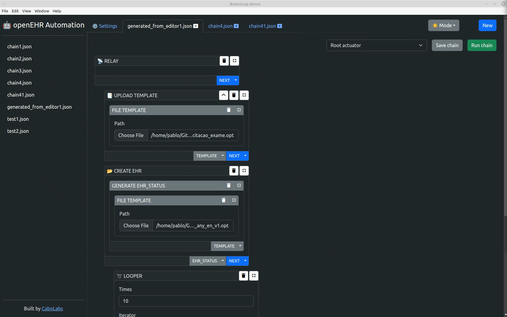

# NoRA

## No-code automation app for interacting with openEHR servers.

NoRA is a simple tool for interacting with openEHR servers and load custom data based on workflows defined by you. Just point and click, no code is required!

* Create different workflows to interact with openEHR servers
* Execute workflow definitions in real time
* Flexible configuration for server authentication
* Save, manage and share your workflow definitions

NoRA is a perfect app to learn about the openEHR REST API. Load specific data in your openEHR server for testing, verification and quality assurance. The advantage is that NoRA doesn't require any programming. Workflows are defined by very intuitive point-and-click interactions, and can executed immediately.

## Demo with Atomik

  

## Demo dark mode

## Download

We have one folder for each platform, you can download the latest release for your specific platform.

Click on the binary file and on the top right there will be a download button .

## Support

NoRA is free to use non open source software.

If you have any questions, comments or ideas, please refer to our [support chat](https://app.gitter.im/#/room/#CaboLabs_NoRA:gitter.im).
